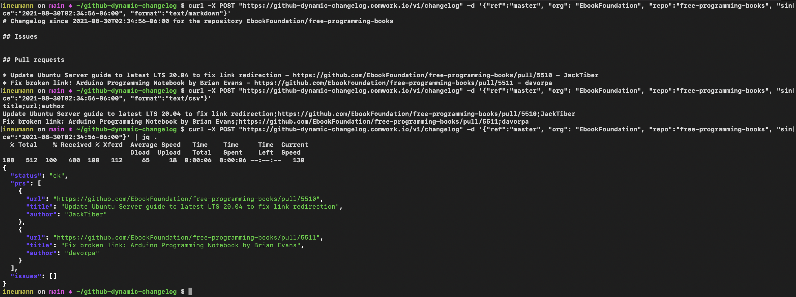

# Github Dynamic Changelog

A restful api which gives you the github changelog of a protected branch in real time.
Usefull to see what is deployed on your environments in a web dashboard.

This api is available as a ready to use docker image.

## Table of content

[[_TOC_]]

## Git repositories

* Main repo: https://gitlab.comwork.io/oss/github-dynamic-changelog
* Github mirror: https://github.com/idrissneumann/github-dynamic-changelog.git
* Gitlab mirror: https://gitlab.com/ineumann/github-dynamic-changelog.git

## Image on the dockerhub

The image is available and versioned here: https://hub.docker.com/r/comworkio/github-dynamic-changelog

## Test the api

Here's an available endpoint to test the api with public repositories: https://github-dynamic-changelog.comwork.io/

Example of results:



You can see the "Endpoints" section below to get all the available endpoints.
## Running with docker-compose

First create your `.env` file from the `.env.example`:

```shell
cp .env.example .env
```

Then replace the values (like the `GITHUB_ACCESS_TOKEN` with one of your own). Then:

```shell
$ docker-compose up
```

If you want to test on a raspberrypi or any other ARM device, use this command instead:

```shell
$ docker-compose -f docker-compose-arm.yml up
```
## Endpoints

### Healthcheck

```shell
$ curl localhost:8080/v1/health
{"status": "ok", "alive": true}
```

### Manifests

```shell
$ curl localhost:8080/v1/manifest 
{"version": "1.0", "sha": "1c7cb1f", "arch": "x86"}
```

### Generate the changelog

```shell
curl localhost:8080/v1/changelog -X POST -d '{"ref":"master", "org": "EbookFoundation", "repo":"free-programming-books", "since":"2021-09-01T02:34:56-06:00", "format":"text/markdown"}' -v
```

Note:
* `format` supports also `text/csv` and `application/json` (which is the default value)
* `filter_author` is not required but if it's defined, it will filter all the pull requests opened by a login matching this value
* `filter_message` is not required but if it's defined, it will filter the commit which have their messages matching this value

### Update the issues associated to a given pull request

Update the issues associated to a given pull request with the target branch (that correspond to an environment).

```shell
curl -X POST "http://localhost:8080/v1/label" -d '{"pr_id":"2648", "org": "idrissneumann", "repo":"shmwrapper"}'
```

Note:
* `label` is not required, if it's not defined, the pull request target branch will be taken as the label to add to the issues
* if you want to change the label color, you might have to create the wanted label to github with the wanted color first

## Add label to your issues with a CI/CD pipelines

We provide a simple client to use that is available on the docker hub here: https://hub.docker.com/r/comworkio/github-label-client

This will invoke the label api (see the previous "Update the issues associated to a given pull request" section) and will take the following environment variables:

* `GITHUB_ORGANIZATION`: the organization or username that own the github repository
* `GITHUB_REPOSITORY`: the repository
* `PR_ID`: the pull request id that will be used to find all the associated issues to label
* `GIT_BRANCH`: the branch that have triggered the pipeline (it need to match `^([0-9]+.[0-9]+.x|master|develop|main|prod|qa|ppd|preprod)$` to perform the api, it's ignored otherwise)
* `API_URL` (not required): the https url of your hosted github api (default : `https://github-dynamic-changelog.comwork.io` which is only able to monitor public repo, so you'll probably have to override it with your own instance ;) )
* `API_USER` (not required): username if the api is protected by a basic auth authentication
* `API_PASSWORD` (not required): password if the api is protected by a basic auth authentication
* `LOG_LEVEL` (not required - default `INFO`): the log level
